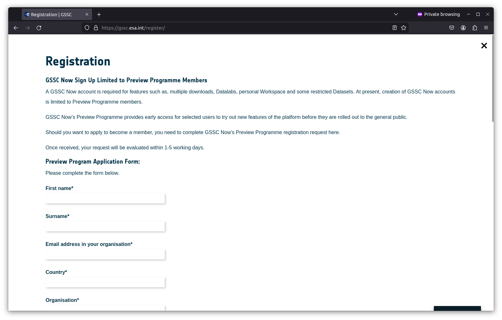
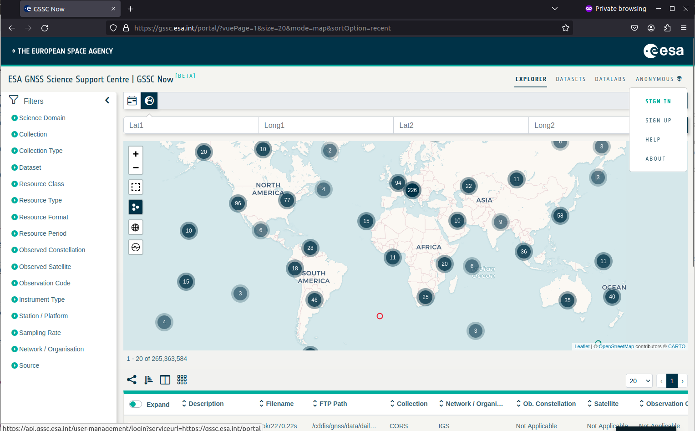
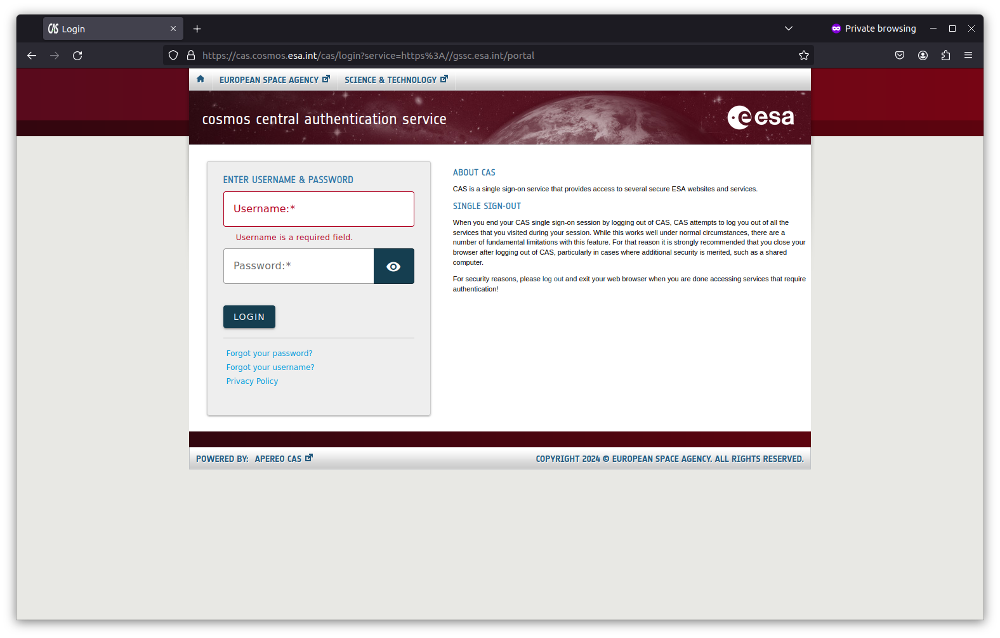
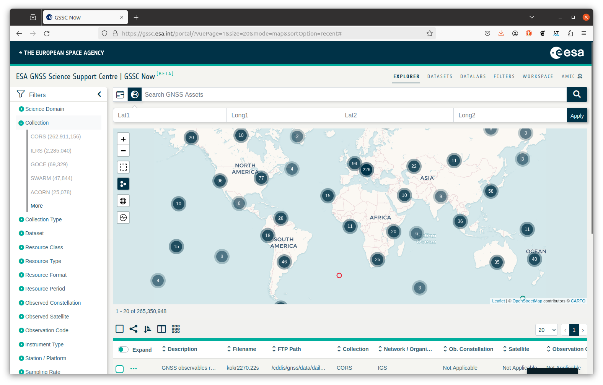
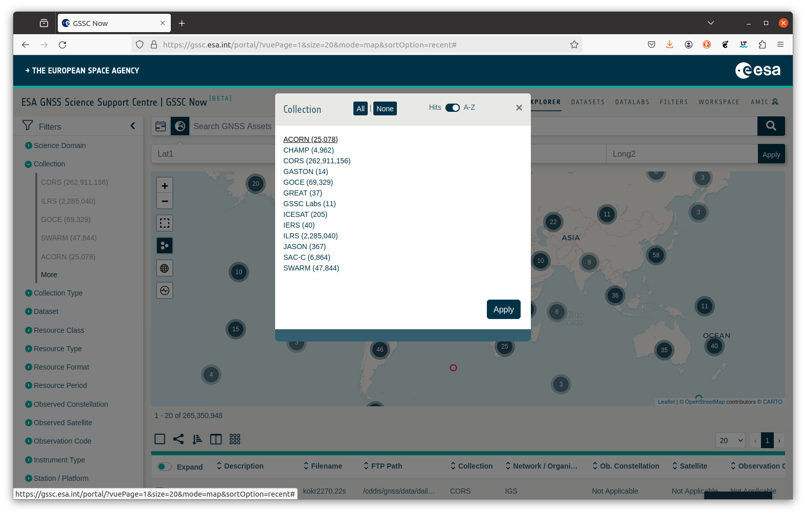

# AMIC project

ESA’s AMIC initiative, spearheaded by Rokubun in partnership with ICTP, tackles a critical obstacle in GNSS-based monitoring of Earth’s Ionosphere and troposphere: the absence of coverage in remote regions such as deserts, oceans, and inaccessible areas. Setting up receivers in these locations presents logistical and financial challenges due to the risk of equipment loss or damage, as well as the high costs associated with maintenance efforts.

The culmination of the AMIC project is the establishment of the ACORN network, short for the AMIC Continuous Operating Reference Network. Comprising primarily Rokubun's MEDEA GNSS computer, this network's data is publicly accessible via the [ESA's GSSC Now portal](https://gssc.esa.int/portal/). 

This tutorial shows how to access the ESA GSSC Now portal and download the data pushed by the MEDEA GNSS receivers into the Acorn Network

## Accessing ACORN data

In order to access the GSSC portal and access the data, you will need to have an account in this service. To register the service, go to the [registration portal](https://gssc.esa.int/register/), shown in the figure below, and fill the form in order to create an account.

With the credentials, you will be able to access the service as a registered user. To log in, go to the [ESA's GSSC Now portal](https://gssc.esa.int/portal/) and click, at the top right part of the screen (as shown in the figure below): `Anonymous` -> `Sign In`. Alternatively, go directly to the [login page](https://api.gssc.esa.int/user-management/login?serviceurl=https://gssc.esa.int/portal) and input your credentials

You will be redirected to the ESA's unified COSMOS login portal, shown below:

Once logged in the portal, you will be able to browse the ACORN files by clicking, in the top left part of the screen (see picture below), `Collection` -> `More`

A pop up window will appear and you will be able to select the `ACORN` network (make sure to click `Apply`, after `ACORN` is underlined)

Once the data collection has been selected, only the RINEX files from the network will be displayed. You will be able to download the files by selecting the files and download them.

## References

- [AMIC project data now available in GSSC](https://gssc.esa.int/news/amic-project-data-now-available-in-gssc/)